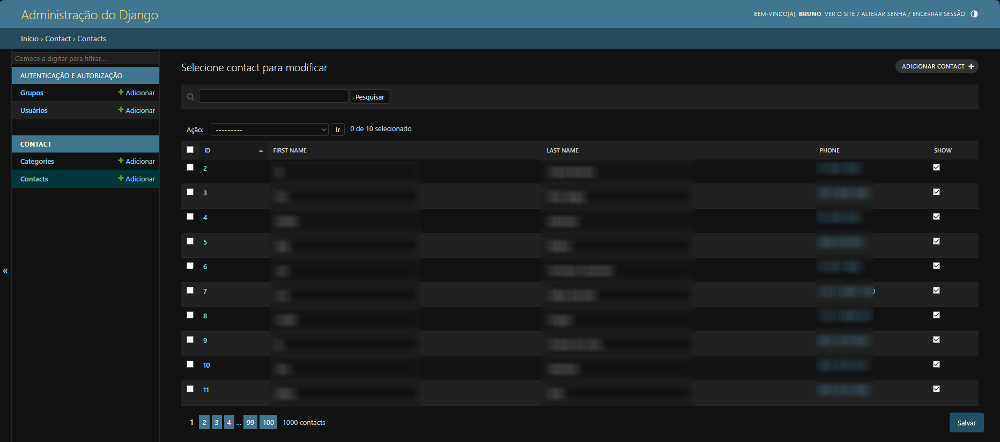

# Agenda
## WIP
Projeto Agenda com Django

    Este projeto foi realizado com base nos estudos do curso <a href="https://www.udemy.com/course/python-3-do-zero-ao-avancado/"><em>Curso de Python 3 do básico ao avançado</em></a> do professor <a href="https://github.com/luizomf"><strong>Luiz Otávio</strong></a>

 

<h2> < Recursos > </h2>

<h3><strong> CRUD </strong></h3>

<strong>(Estando Logado)</strong> Um usuário pode criar <em>(Create)</em>, modificar <em>(Update)</em> e deletar <em>(Delete)</em> um contato segundo as rotas indicadas na página principal e na rota única de cada contato.

<strong>(Estando Deslogado)</strong> Um visitante só pode ler um contato pela página principal ou pela página única de cada contato. Ao tentar entrar em uma rota <em>requerida</em>, o visitante é redirecionado para a área de <em>login de usuários</em>.

<h3><strong> Banco de dados </strong></h3>

Foi desenvolvino no projeto um banco de dados utilizando os recursos de <em>MODELS</em> do django. Os dados estão relacionados a criação de contatos da aplicação

O banco é gerado com base no arquivo <em>models.py</em> dentro da aplicação principal "<em>contact</em>" e possui os seguintes campos:

    <table>
        <tr>
            <th>Campo</th>
            <th>Tipo</th>
        </tr>
        <tr>
            <td><abbr title="Primeiro Nome">first_name</td></abbr>
            <td>Char Field</td>
        </tr>
        <tr>
            <td><abbr title="Sobrenome">last_name</abbr></td>
            <td>Char Field</td>
        </tr>
        <tr>
            <td><abbr title="Numero de celular">phone</abbr></td>
            <td>Char Field</td>
        </tr>
        <tr>
            <td><abbr title="Email">email</abbr></td>
            <td>Email Field</td>
        </tr>
        <tr>
            <td><abbr title="Data de criação (automático)">created_date</abbr></td>
            <td>Date Time Field</td>
        </tr>
        <tr>
            <td><abbr title="Descrição do contato">description</abbr></td>
            <td>Text Field</td>
        </tr>
        <tr>
            <td><abbr title="Visibilidade do contato">show</abbr></td>
            <td>Boolean Field</td>
        </tr>
        <tr>
            <td><abbr title="Imagem do contato">picture</abbr></td>
            <td>Image Field</td>
        </tr>
        <tr>
            <td><abbr title="Categoria do contato">category</abbr></td>
            <td><em>Foreign Key</em></td>
        </tr>
        <tr>
            <td><abbr title="Criador do contato">owner</abbr></td>
            <td><em>ForeignKey</em></td>
        </tr>
    </table>

<h3><strong> Painel de administrador </strong></h3>

    O painel de <em>super-usuário</em> do django possui novos filtros para facilitar a pesquisa alem de permitir uma facil modificação de qualquer contato
    

